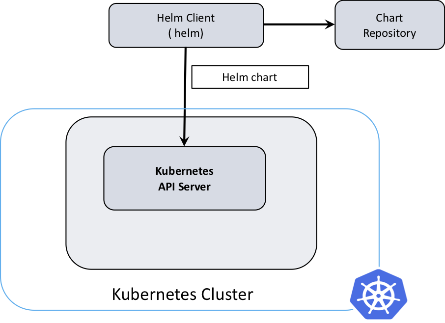

# Helm

[Helm](https://helm.sh/) is often described as the Kubernetes application package manager.

> Helm is a tool that streamlines installation and management of Kubernetes applications. It uses a packaging format called "charts", which are a collection of files that describe Kubernetes resources. It can run anywhere (laptop, CI/CD, etc.) and is available for various operating systems, like OSX, Linux and Windows.

## Helm Architecture



## Helm Components

- helm
- Chart
- Config
- Release
- Repository

### helm - Helm Client

Helm client renders charts into manifest files. It interacts directly with the Kubernetes API server to install, upgrade, query, and remove Kubernetes resources.

```shell script
$ curl -sSL https://raw.githubusercontent.com/helm/helm/master/scripts/get-helm-3 | bash

$ helm version
version.BuildInfo{Version:"v3.4.1", GitCommit:"c4e74854886b2efe3321e185578e6db9be0a6e29", GitTreeState:"dirty", GoVersion:"go1.15.4"}
```

### Chart

Chart contains all of the resource definitions necessary to run an application, tool, or service inside of a Kubernetes cluster. A chart is basically a package of pre-configured Kubernetes resources.

```shell script
$ helm create mychart

.
├── Chart.yaml    \\ A YAML file containing information about the chart
├── LICENSE       \\ A plain text file containing the license for the chart
├── README.md     \\ A README providing information about the chart usage, configuration, installation etc.
├── templates     \\ A directory of templates that will generate valid Kubernetes manifest files when combined with values.yaml
│   ├── _helpers.tpl               \\ Template helpers/definitions that are re-used throughout the chart
│   ├── guestbook-deployment.yaml  \\ Guestbook app container resource
│   ├── guestbook-service.yaml     \\ Guestbook app service resource
│   ├── NOTES.txt                  \\ A plain text file containing short usage notes about how to access the app post install
│   ├── redis-master-deployment.yaml  \\ Redis master container resource
│   ├── redis-master-service.yaml     \\ Redis master service resource
│   ├── redis-slave-deployment.yaml   \\ Redis slave container resource
│   └── redis-slave-service.yaml      \\ Redis slave service resource
└── values.yaml   \\ The default configuration values for the chart
```

### Config

This contains configuration information that can be merged into a packaged chart to create a releasable object.

### Release

An instance of a chart running in a Kubernetes cluster.

To check the number of deployments:
```shell script
$ helm history guestbook-demo -n helm-demo
REVISION    UPDATED                     STATUS      CHART           APP VERSION DESCRIPTION
1           Mon Feb 24 18:08:02 2020    superseded  guestbook-0.2.0             Install complete
2           Tue Feb 25 14:23:27 2020    deployed    guestbook-0.2.0             Upgrade complete
```
To Roll back to the previous revision:
```shell script
$ helm rollback guestbook-demo 1 -n helm-demo
Rollback was a success! Happy Helming!

$ helm history guestbook-demo -n helm-demo
REVISION    UPDATED                     STATUS      CHART           APP VERSION DESCRIPTION
1           Mon Feb 24 18:08:02 2020    superseded  guestbook-0.2.0             Install complete
2           Tue Feb 25 14:23:27 2020    superseded  guestbook-0.2.0             Upgrade complete
3           Tue Feb 25 14:53:45 2020    deployed    guestbook-0.2.0             Rollback to 1
```

### Repository

Place where charts reside and can be shared with others.

Useful commands:
```shell script
helm repo list
helm repo add helm101 https://ibm.github.io/helm101/
helm search repo helm101
```
Read more about [The Chart Repository Guide](https://helm.sh/docs/topics/chart_repository/)

#### Private Repository with GCS

[helm-gcs](https://github.com/hayorov/helm-gcs) is a helm plugin that allows you to manage private helm repositories on Google Cloud Storage aka buckets.

```shell script
$ helm plugin install https://github.com/hayorov/helm-gcs.git --version 0.3.7

$ helm plugin list
NAME	VERSION	DESCRIPTION
gcs 	0.3.7  	Manage repositories on Google Cloud Storage

$ export GOOGLE_APPLICATION_CREDENTIALS="/tmp/helm-gcr.json"

# Init a new repository
# helm gcs init gs://bucket/path
$ helm gcs init gs://devops-helm-repo

# Add your repository to Helm
# helm repo add repo-name gs://bucket/path
$ helm repo add devops-helm-repo gs://devops-helm-repo

$ helm repo list
NAME            URL
devops-helm-repo gs://devops-helm-repo

# Push a chart to your repository
$ helm gcs push chart.tar.gz repo-name

# Update Helm cache
$ helm repo update

# Push a chart
$ helm package my-chart
$ helm gcs push my-chart-<semver>.tgz my-repository

# Fetch the chart
$ helm fetch repo-name/chart
$ helm fetch repo-name/chart --version 0.1.0

# Remove the chart
$ helm gcs remove my-chart my-repository
$ helm gcs remove my-chart my-repository --version 0.1.0
```

# Jenkins Shared Libraries

This has two parts: Build and Push Helm Chart, Install or Uninstall Helm Charts

## Build and Push Helm Chart

```shell script
$ cat jenkins-shared-libraries/resources/podtemplates/helm.yml

kind: Pod
metadata:
  name: helm
spec:
  containers:
  - name: helm
    image: dtzar/helm-kubectl:3.6.3
    imagePullPolicy: IfNotPresent
    command: ["sleep"]
    args: ["100000"]
    volumeMounts:
      - name: gcs-secret
        mountPath: /secret
    env:
      - name: GOOGLE_APPLICATION_CREDENTIALS
        value: /secret/gcs-secret.json
  volumes:
    - name: gcs-secret
      secret:
        secretName: gcs-secret
```

```shell script
$ cat jenkins-shared-libraries/vars/helmChartVersion.groovy

def call(Map config) {
    yaml = readYaml file: config.yamlFile
    env.CHART_VERSION = "${yaml.version}"
    sh "echo ${CHART_VERSION}"
}
```

```shell script
$ cat jenkins-shared-libraries/vars/imageNameTag.groovy
import java.text.SimpleDateFormat

def call() {
    displayName = new SimpleDateFormat("yy.MM.dd").format(new Date())
    currentBuild.displayName = "${displayName}-${env.BUILD_NUMBER}"
    env.IMAGE_TAG = "${currentBuild.displayName}"
    sh "echo Docker Image Tag will be ${IMAGE_TAG}"
}
```

```shell script
$ cat jenkins-shared-libraries/vars/helmBuildPush.groovy

def call(Map config, Closure body) {
  def appName = config.appName
  def chartRepo = config.chartRepo ?: 'devops-helm-repo'
  def chartPath = config.chartPath ?: 'helm'
  def bucketName = config.bucketName ?: 'devops-helm-repo'
  def bucketPath = config.bucketPath ?: 'devops'
  def label = "helm-${UUID.randomUUID().toString()}"
  def podYaml = libraryResource 'podtemplates/helm.yml'
  podTemplate(name: 'helm', label: label, yaml: podYaml) {
    node(label) {
      body()
      //get the chart version
      helmChartVersion(
              yamlFile: "${pwd()}/${chartPath}/Chart.yaml",
      )
      imageNameTag()
      container(name: 'helm') {
          echo "Linting Helm Chart"
          sh """
             helm lint ${pwd()}/${chartPath}
          """
          echo "Adding Helm GCS Repo"
          sh """
            helm plugin install https://github.com/hayorov/helm-gcs.git --version 0.3.7
            helm repo add ${chartRepo} gs://${bucketName}/${bucketPath} --force-update
            helm repo update
          """
          echo "Packaging Helm Chart"
          sh """
             helm package ${pwd()}/${chartPath}
          """
          echo "Pushing Helm Chart"
          sh """
             helm gcs push ${appName}-${CHART_VERSION}.tgz ${chartRepo} --force
          """
      }
    }
  }
}
```

```shell script
$ cat Jenkinsfile

#!/usr/bin/env groovy

@Library('jenkins-shared-libraries@v5.6') _

pipeline {

    agent any
    
    options {
        // Build auto timeout
        timeout(time: 60, unit: 'MINUTES')
    }

    // Some global default variables
    environment {
        credId      = "GitCreds"        
        appName     = "devops-guestbook"
        gitRepo     = "https://github.com/IBM/guestbook.git"
    }
    
    parameters {        
        string (name: 'GIT_BRANCH', defaultValue: 'master',  description: 'Git Branch')
        booleanParam(defaultValue: false, name: 'BUILD_HELM', description: 'Build and Push Helm Chart')        
    }

    ...

    stage('Build and Push Helm Chart') {
      when {
         expression { params.BUILD_HELM == true }
      }
      steps {
        helmBuildPush(appName: "${appName}") {
            retry(3) {
                echo "Code checkout"
                
                git branch: "${params.GIT_BRANCH}",
                    credentialsId: "${credId}",
                    url: "${gitRepo}"
            }
        }
      }
    }
```

## Install Helm Chart

```shell script
$ cat jenkins-shared-libraries/resources/podtemplates/install-helm.yml

kind: Pod
metadata:
  name: install-helm
spec:
  serviceAccountName: jenkins
  containers:
  - name: helm
    image: dtzar/helm-kubectl:3.6.3
    imagePullPolicy: IfNotPresent
    command: ["sleep"]
    args: ["100000"]
    volumeMounts:
      - name: gcs-secret
        mountPath: /secret
      - name: dev-kubeconfig
        mountPath: /development
      - name: prod-kubeconfig
        mountPath: /production
    env:
      - name: GOOGLE_APPLICATION_CREDENTIALS
        value: /secret/gcs-secret.json
  - name: kubeval
    image: kubeval:0.15.0-3.6.3
    imagePullPolicy: IfNotPresent
    command: ["sleep"]
    args: ["100000"]
  imagePullSecrets:
  - name: gcr-json-key
  volumes:
    - name: gcs-secret
      secret:
        secretName: gcs-secret
    - name: dev-kubeconfig
      secret:
        secretName: dev-kubeconfig
    - name: prod-kubeconfig
      secret:
        secretName: prod-kubeconfig
``` 

```shell script
$ cat jenkins-shared-libraries/vars/onpremDeployToDev.groovy

def call(Map config, Closure body) {
  def appName = config.appName
  def releaseName = config.releaseName ?: config.appName
  def nameSpace = config.nameSpace ?: 'default'
  def valueFile = config.valueFile ?: 'dev.yaml'
  def chartRepo = config.chartRepo ?: 'devops-helm-repo'
  def bucketName = config.bucketName ?: 'devops-helm-repo'
  def bucketPath = config.bucketPath ?: 'devops'
  def chartPath = config.chartPath ?: 'helm'
  def chartVersion = config.chartVersion ?: 'latest'
  def timeout = config.timeout ?: '5m0s'
  def label = "install-helm-${UUID.randomUUID().toString()}"
  def podYaml = libraryResource 'podtemplates/install-helm.yml'
  podTemplate(name: 'install-helm', label: label, yaml: podYaml) {
    node(label) {
      body()
      container(name: 'kubeval') {
          echo "Linting Helm Chart"
          sh """
             helm lint ${pwd()}/${chartPath} --values ${pwd()}/values/${valueFile}
          """
          echo "Setting KUBEVAL_SCHEMA_LOCATION"
          sh """
            export KUBEVAL_SCHEMA_LOCATION=/usr/local/kubeval/schemas
          """
          echo "Validating Helm Chart for DEV"
          sh """
             helm template ${pwd()}/${chartPath} --values ${pwd()}/values/${valueFile} > /usr/local/kubeval/schemas/dev.yaml
             kubeval --kubernetes-version 1.18.1 --strict --force-color --ignore-missing-schemas /usr/local/kubeval/schemas/dev.yaml
          """
      }
        container(name: "helm") {
            echo "Setting credentials for a running cluster"
            sh """
                mkdir -p ~/.kube
                cp /development/config ~/.kube/config
                chmod o-r ~/.kube/config
                chmod g-r ~/.kube/config
                kubectl get po -n ${nameSpace}
            """
            echo "Adding Helm GCS Repo"
            sh """
                helm plugin install https://github.com/hayorov/helm-gcs.git --version 0.3.7
                helm repo add ${chartRepo} gs://${bucketName}/${bucketPath}
                helm repo update
                helm repo list
            """
            echo "Installing Helm Chart"
            if (chartVersion == "latest") {
                sh """
                    helm upgrade --install --debug --dry-run --namespace ${nameSpace} --values ${pwd()}/values/${valueFile} ${releaseName} ${chartRepo}/${appName}
                    helm upgrade --install --atomic --timeout ${timeout} --namespace ${nameSpace} --values ${pwd()}/values/${valueFile} ${releaseName} ${chartRepo}/${appName}
                """
            } else {
                sh """
                    helm upgrade --install --debug --dry-run --namespace ${nameSpace} --values ${pwd()}/values/${valueFile} ${releaseName} ${chartRepo}/${appName} --version ${chartVersion}
                    helm upgrade --install --atomic --timeout ${timeout} --namespace ${nameSpace} --values ${pwd()}/values/${valueFile} ${releaseName} ${chartRepo}/${appName} --version ${chartVersion}
                """
            }
        }
    }
  }
}
```

```shell script
$ cat jenkins-shared-libraries/vars/onpremDeployToProd.groovy

def call(Map config, Closure body) {
  def appName = config.appName
  def releaseName = config.releaseName ?: config.appName
  def nameSpace = config.nameSpace ?: 'default'
  def valueFile = config.valueFile ?: 'prod.yaml'
  def chartRepo = config.chartRepo ?: 'devops-helm-repo'
  def bucketName = config.bucketName ?: 'devops-helm-repo'
  def bucketPath = config.bucketPath ?: 'devops'
  def chartPath = config.chartPath ?: 'helm'
  def chartVersion = config.chartVersion ?: 'latest'
  def timeout = config.timeout ?: '5m0s'
  def label = "install-helm-${UUID.randomUUID().toString()}"
  def podYaml = libraryResource 'podtemplates/install-helm.yml'
  podTemplate(name: 'install-helm', label: label, yaml: podYaml) {
    node(label) {
      body()
      container(name: 'kubeval') {
          echo "Linting Helm Chart"
          sh """
             helm lint ${pwd()}/${chartPath} --values ${pwd()}/values/${valueFile}
          """
          echo "Setting KUBEVAL_SCHEMA_LOCATION"
          sh """
            export KUBEVAL_SCHEMA_LOCATION=/usr/local/kubeval/schemas
          """
          echo "Validating Helm Chart for PROD"
          sh """
             helm template ${pwd()}/${chartPath} --values ${pwd()}/values/${valueFile} > /usr/local/kubeval/schemas/prod.yaml
             kubeval --kubernetes-version 1.18.1 --strict --force-color --ignore-missing-schemas /usr/local/kubeval/schemas/prod.yaml
          """
      }
        container(name: "helm") {
            echo "Setting credentials for a running cluster"
            sh """
                mkdir -p ~/.kube
                cp /production/config ~/.kube/config
                chmod o-r ~/.kube/config
                chmod g-r ~/.kube/config
                kubectl get po -n ${nameSpace}
            """
            echo "Adding Helm GCS Repo"
            sh """
                helm plugin install https://github.com/hayorov/helm-gcs.git --version 0.3.7
                helm repo add ${chartRepo} gs://${bucketName}/${bucketPath}
                helm repo update
                helm repo list
            """
            echo "Installing Helm Chart"
            if (chartVersion == "latest") {
                sh """
                    helm upgrade --install --debug --dry-run --namespace ${nameSpace} --values ${pwd()}/values/${valueFile} ${releaseName} ${chartRepo}/${appName}
                    helm upgrade --install --atomic --timeout ${timeout} --namespace ${nameSpace} --values ${pwd()}/values/${valueFile} ${releaseName} ${chartRepo}/${appName}
                """
            } else {
                sh """
                    helm upgrade --install --debug --dry-run --namespace ${nameSpace} --values ${pwd()}/values/${valueFile} ${releaseName} ${chartRepo}/${appName} --version ${chartVersion}
                    helm upgrade --install --atomic --timeout ${timeout} --namespace ${nameSpace} --values ${pwd()}/values/${valueFile} ${releaseName} ${chartRepo}/${appName} --version ${chartVersion}
                """
            }
        }
    }
  }
```

```shell script
$ cat Jenkinsfile

#!/usr/bin/env groovy

@Library('jenkins-shared-libraries@v5.6') _

pipeline {

    agent any
    
    options {
        // Build auto timeout
        timeout(time: 60, unit: 'MINUTES')
    }

    // Some global default variables
    environment {
        credId      = "GitCreds"        
        appName     = "devops-guestbook"
        gitRepo     = "https://github.com/IBM/guestbook.git"
    }
    
    parameters {        
        string (name: 'GIT_BRANCH', defaultValue: 'master',  description: 'Git Branch')
        booleanParam(defaultValue: false, name: 'BUILD_HELM', description: 'Build and Push Helm Chart')        
    }

    ...

    stage('Deploy to DEV K8s') {
      steps {
        onpremDeployToDev(appName: "${appName}", nameSpace: "${nameSpace}", timeout: "10m") {
            retry(3) {
                checkout scm
                git branch: "${params.GIT_BRANCH}",
                    credentialsId: "${credId}",
                    url: "${gitRepo}"
            }
        }
      }
    }
    stage('Approval for Production') {
        steps {
          sendNotification(message: "Job: <${env.RUN_DISPLAY_URL}|${env.JOB_NAME}> with buildnumber ${env.BUILD_NUMBER} Waiting for approval! Timeout in 30 Minutes") {
          }
          script {
            timeout(time: 30, unit: 'MINUTES') {
                userInput = input(id: 'confirm', message: 'Please confirm to deploy to production.', parameters: [ [$class: 'BooleanParameterDefinition', defaultValue: false, description: 'Please confirm to deploy to production.', name: 'confirm'] ])
            }
          }
        }
    }
    stage('Deploy to Prod K8s') {
      when {
         expression { params.GIT_BRANCH == 'master' }
      }      
      steps {
        onpremDeployToProd(appName: "${appName}", nameSpace: "${nameSpace}", timeout: "10m") {
            retry(3) {
              checkout scm
              git branch: "${params.GIT_BRANCH}",
                credentialsId: "${credId}",
                url: "${gitRepo}"
            }
        }
      }
    }
```

# Uninstall Helm Chart

```shell script
$ cat jenkins-shared-libraries/vars/onPremUninstallDev.groovy

def call(Map config, Closure body) {
  def appName = config.appName
  def releaseName = config.releaseName ?: config.appName
  def nameSpace = config.nameSpace ?: 'default'
  def chartRepo = config.chartRepo ?: 'devops-helm-repo'
  def bucketName = config.bucketName ?: 'devops-helm-repo'
  def bucketPath = config.bucketPath ?: 'devops'
  def timeout = config.timeout ?: '5m0s'
  def label = "install-helm-${UUID.randomUUID().toString()}"
  def podYaml = libraryResource 'podtemplates/install-helm.yml'
  podTemplate(name: 'install-helm', label: label, yaml: podYaml) {
    node(label) {
      body()
        container(name: "helm") {
            echo "Setting credentials for a running cluster"
            sh """
                mkdir -p ~/.kube
                cp /development/config ~/.kube/config
                chmod o-r ~/.kube/config
                chmod g-r ~/.kube/config
                kubectl get po -n ${nameSpace}
            """
            echo "Adding Helm GCS Repo"
            sh """
                helm plugin install https://github.com/hayorov/helm-gcs.git --version 0.3.7
                helm repo add ${chartRepo} gs://${bucketName}/${bucketPath}
                helm repo update
                helm repo list
                helm list --namespace ${nameSpace} 
            """
            echo "Dry run uninstalling Helm Chart "
            sh """
                helm uninstall --timeout ${timeout} --namespace ${nameSpace} ${releaseName} --dry-run
            """
            echo "Uninstalling Helm Chart"
            sh """
                helm uninstall --timeout ${timeout} --namespace ${nameSpace} ${releaseName}
            """
        }
    }
  }
}
```

```shell script
$ cat jenkins-shared-libraries/vars/onPremUninstallProd.groovy

def call(Map config, Closure body) {
  def appName = config.appName
  def releaseName = config.releaseName ?: config.appName
  def nameSpace = config.nameSpace ?: 'default'
  def chartRepo = config.chartRepo ?: 'devops-helm-repo'
  def bucketName = config.bucketName ?: 'devops-helm-repo'
  def bucketPath = config.bucketPath ?: 'devops'
  def timeout = config.timeout ?: '5m0s'
  def label = "install-helm-${UUID.randomUUID().toString()}"
  def podYaml = libraryResource 'podtemplates/install-helm.yml'
  podTemplate(name: 'install-helm', label: label, yaml: podYaml) {
    node(label) {
      body()
        container(name: "helm") {
            echo "Setting credentials for a running cluster"
            sh """
                mkdir -p ~/.kube
                cp /production/config ~/.kube/config
                chmod o-r ~/.kube/config
                chmod g-r ~/.kube/config
                kubectl get po -n ${nameSpace}
            """
            echo "Adding Helm GCS Repo"
            sh """
                helm plugin install https://github.com/hayorov/helm-gcs.git --version 0.3.7
                helm repo add ${chartRepo} gs://${bucketName}/${bucketPath}
                helm repo update
                helm repo list
                helm list --namespace ${nameSpace} 
            """
            echo "Dry run uninstalling Helm Chart "
            sh """
                helm uninstall --timeout ${timeout} --namespace ${nameSpace} ${releaseName} --dry-run
            """
            echo "Uninstalling Helm Chart"
            sh """
                helm uninstall --timeout ${timeout} --namespace ${nameSpace} ${releaseName}
            """
        }
    }
  }
}
```

# kubeval 

> [Kubeval](https://kubeval.instrumenta.dev/) is used to validate one or more Kubernetes configuration files, and is often used locally as part of a development workflow as well as in CI pipelines.

```shell script
FROM alpine:latest

ENV KUBE_VERSION v1.18.1
ENV HELM_V3 v3.6.3
RUN apk --no-cache add ca-certificates wget && \
    wget https://github.com/instrumenta/kubeval/releases/latest/download/kubeval-linux-amd64.tar.gz && \
    tar xf kubeval-linux-amd64.tar.gz && \
    mv kubeval /usr/local/bin && \
    wget https://get.helm.sh/helm-$HELM_V3-linux-amd64.tar.gz && \
    tar -zxvf helm-$HELM_V3-linux-amd64.tar.gz && \
    mv linux-amd64/helm /usr/local/bin/helm && \
    mkdir -p /usr/local/kubeval/schemas

WORKDIR /usr/local/kubeval/schemas
COPY v1.18.1 /usr/local/kubeval/schemas/v1.18.1
```

Getting [Kubernetes JSON Schemas](https://github.com/instrumenta/kubernetes-json-schema)
 
```shell script
curl https://codeload.github.com/instrumenta/kubernetes-json-schema/tar.gz/master | \
tar -C /Users/nirav.chotai/Downloads/kubeval --strip-components=1 -xzf - kubernetes-json-schema-master/v1.18.1
```

