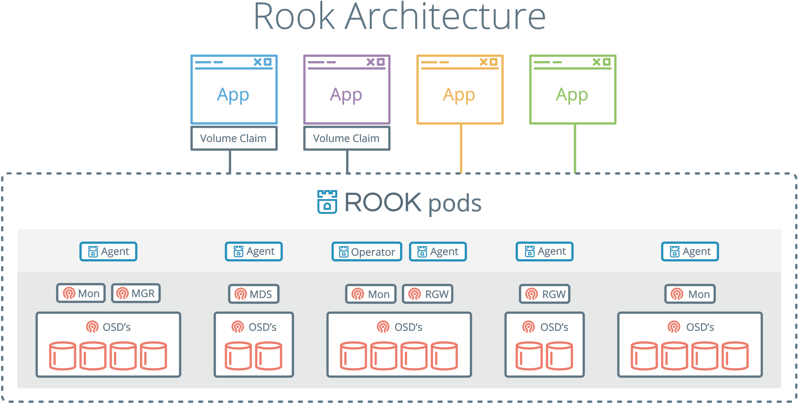

# Rook Operator & Ceph Storage on Kubernetes

Rook uses the power of the Kubernetes platform to deliver its services via a Kubernetes Operator for each storage provider.

> [Rook](https://rook.io/) turns distributed storage systems into self-managing, self-scaling, self-healing storage services. It automates the tasks of a storage administrator: deployment, bootstrapping, configuration, provisioning, scaling, upgrading, migration, disaster recovery, monitoring, and resource management.

As of now, only Ceph is stable with Rook

> [Ceph](https://ceph.com/en/) is a distributed storage system that provides file, block and object storage and is deployed in large scale production clusters.

Please refer to the [project status](https://github.com/rook/rook/blob/master/README.md#project-status) section of the Rook repository.

# Architecture

Rook enables Ceph storage systems to run on Kubernetes using Kubernetes primitives. The following image illustrates how Ceph Rook integrates with Kubernetes:



# Design


# Rook Setup

There are two main components: Ceph Operator, Ceph Cluster

One single `Ceph` operator can manage multiple `Ceph` clusters.

## Ceph Operator Installation

The Ceph Operator helm chart will install the basic components necessary to create a storage platform for your Kubernetes cluster.

```shell script
helm repo add rook-release https://charts.rook.io/release

helm install --namespace rook-ceph rook-ceph rook-release/rook-ceph -f values.yaml
```
Example `values.yaml`
```shell script
resources:
  limits:
    cpu: 1
    memory: 4Gi
  requests:
    cpu: 1
    memory: 4Gi

csi:
  enableRbdDriver: true
  enableCephfsDriver: true
  registrar:
    image: quay.io/k8scsi/csi-node-driver-registrar:v2.0.1
  pluginTolerations:
     - key: storage
       operator: Equal
       value: ceph
       effect: NoSchedule

discover:
  tolerations:
     - key: storage
       operator: Equal
       value: ceph
       effect: NoSchedule

imagePullSecrets:
- name: my-registry-secret
```
See the [complete list](https://rook.io/docs/rook/v1.7/helm-operator.html#configuration) of available parameters.

```shell script
(base) ➜  ~ kubectl -n rook-ceph get pod -l app=rook-ceph-operator
NAME                                  READY   STATUS    RESTARTS   AGE
rook-ceph-operator-679cdc9558-bfpff   1/1     Running   0          24m
```

## Ceph Cluster Installation

### Ceph Prerequisites

In order to configure the Ceph storage cluster, at least one of these local storage options are required:

- Raw devices (no partitions or formatted filesystems)
- Raw partitions (no formatted filesystem)
- PVs available from a storage class in block mode

You can confirm whether your partitions or devices are formatted filesystems with the following command.
```shell script
# lsblk -f

NAME                  FSTYPE      LABEL UUID                                   MOUNTPOINT
vda
└─vda1                LVM2_member       >eSO50t-GkUV-YKTH-WsGq-hNJY-eKNf-3i07IB
 ├─ubuntu--vg-root   ext4              c2366f76-6e21-4f10-a8f3-6776212e2fe4   /
 └─ubuntu--vg-swap_1 swap              9492a3dc-ad75-47cd-9596-678e8cf17ff9   [SWAP]
vdb
```
If the `FSTYPE` field is not empty, there is a filesystem on top of the corresponding device. In this case, you can use `vdb` for `Ceph` and can’t use `vda` and its partitions.

Ceph OSDs have a dependency on LVM
```shell script
# CentOS
sudo yum install -y lvm2
# Ubuntu
sudo apt-get install -y lvm2
```

Kernel requirements for RBD:
> Ceph requires a Linux kernel built with the RBD module. Many Linux distributions have this module, but not all distributions. For example, the GKE Container-Optimised OS (COS) does not have RBD.
```shell script
# sudo modprobe rbd

# lsmod | grep rbd
rbd                    86016  0
libceph               311296  2 ceph,rbd
```

Kernel requirements for CephFS:
> If you will be creating volumes from a Ceph shared file system (CephFS), the recommended minimum kernel version is 4.17. If you have a kernel version less than 4.17, the requested PVC sizes will not be enforced. Storage quotas will only be enforced on newer kernels.

### Ceph Cluster Helm Chart

Creates Rook resources to configure a Ceph cluster using the Helm package manager. This chart is a simple packaging of templates that will optionally create Rook resources such as:

- CephCluster, CephFilesystem, and CephObjectStore CRs
- Storage classes to expose Ceph RBD volumes, CephFS volumes, and RGW buckets
- Ingress for external access to the dashboard
- Toolbox

```shell script
helm repo add rook-release https://charts.rook.io/release

helm install --create-namespace --namespace rook-ceph rook-ceph-cluster -f values.yaml
```

Example `values.yaml`
```shell script
# cluster level storage configuration and selection
# https://github.com/rook/rook/blob/master/Documentation/ceph-cluster-crd.md#storage-selection-settings
storage:
  env: prod

cluster:
  name: rook-cephfs

dataDirHostPath: /var/lib/rook-cephfs

image:
  repository: ceph/ceph
  tag: v15.2.4-20200630

imagePullSecrets:
  - name: gcr-json-key

dashboard:
  enabled: true
  urlPrefix: /cephfs-dashboard
  port: 8080
  ssl: false

toolbox:
  image:
    repository: rook/ceph
    tag: v1.4.3
    imagePullPolicy: IfNotPresent
```
See the [complete list](https://rook.io/docs/rook/v1.7/helm-ceph-cluster.html#configuration) of available parameters.

After installation, you'll see deployments of `mgr`, `mon`, `osd`, `rbdplugin`, `cephfsplugin` and `tools` 

```shell script
(base) ➜  ~ kubectl get deploy -n rook-ceph
NAME                                            READY   UP-TO-DATE   AVAILABLE   AGE
csi-cephfsplugin-provisioner                    2/2     2            2           267d
csi-rbdplugin-provisioner                       2/2     2            2           351d
rook-ceph-crashcollector-k8s-prod-21            1/1     1            1           13d
rook-ceph-crashcollector-k8s-prod-22            1/1     1            1           13d
rook-ceph-crashcollector-k8s-prod-23            1/1     1            1           13d
rook-ceph-crashcollector-k8s-prod-24            1/1     1            1           13d
rook-ceph-mgr-a                                 1/1     1            1           477d
rook-ceph-mon-b                                 1/1     1            1           30h
rook-ceph-mon-d                                 1/1     1            1           214d
rook-ceph-mon-e                                 1/1     1            1           30h
rook-ceph-operator                              1/1     1            1           477d
rook-ceph-osd-10                                1/1     1            1           13d
rook-ceph-osd-11                                1/1     1            1           13d
rook-ceph-osd-12                                1/1     1            1           13d
rook-ceph-osd-13                                1/1     1            1           13d
rook-ceph-osd-14                                1/1     1            1           13d
rook-ceph-osd-15                                1/1     1            1           13d
rook-ceph-osd-4                                 1/1     1            1           13d
rook-ceph-osd-9                                 1/1     1            1           13d
rook-ceph-tools                                 1/1     1            1           477d

(base) ➜  ~ kubectl get ds -n rook-ceph
NAME               DESIRED   CURRENT   READY   UP-TO-DATE   AVAILABLE   NODE SELECTOR   AGE
csi-cephfsplugin   142       142       142     142          142         <none>          267d
csi-rbdplugin      142       142       142     142          142         <none>          352d
rook-discover      142       142       142     142          142         <none>          352d
```
Tools can be used to run any `Ceph` commands:
```shell script
(base) ➜  ~ kubectl -n rook-ceph get pod -l "app=rook-ceph-tools"
NAME                              READY   STATUS    RESTARTS   AGE
rook-ceph-tools-b5765bff4-fprsr   1/1     Running   0          82d

(base) ➜  ~ kubectl -n rook-ceph exec -it $(kubectl -n rook-ceph get pod -l "app=rook-ceph-tools" -o jsonpath='{.items[0].metadata.name}') -- bash
[root@rook-ceph-tools-b5765bff4-fprsr /]# ceph -s
  cluster:
    id:     c40d82d5-3193-457d-a628-a3db67839a37
    health: HEALTH_OK
 
  services:
    mon: 3 daemons, quorum b,d,e (age 30h)
    mgr: a(active, since 28h)
    osd: 8 osds: 8 up (since 4d), 8 in (since 6d)
 
  data:
    pools:   4 pools, 97 pgs
    objects: 1.79M objects, 6.8 TiB
    usage:   20 TiB used, 82 TiB / 102 TiB avail
    pgs:     96 active+clean
             1  active+clean+scrubbing+deep
 
  io:
    client:   60 KiB/s rd, 32 MiB/s wr, 2 op/s rd, 191 op/s wr
 
[root@rook-ceph-tools-b5765bff4-fprsr /]# 
```
Get the `StorageClass` and `CephCluster`:
```shell script
(base) ➜  ~ kubectl get storageclasses
NAME                PROVISIONER                     RECLAIMPOLICY   VOLUMEBINDINGMODE      ALLOWVOLUMEEXPANSION   AGE
rook-ceph-block     rook-ceph.rbd.csi.ceph.com      Delete          Immediate              true                   477d
rook-cephfs         rook-ceph.cephfs.csi.ceph.com   Delete          Immediate              true                   266d

(base) ➜  ~ kubectl get cephcluster -n rook-ceph
NAME        DATADIRHOSTPATH   MONCOUNT   AGE    PHASE   MESSAGE                        HEALTH
rook-ceph   /var/lib/rook     3          477d   Ready   Cluster created successfully   HEALTH_OK

(base) ➜  ~ kubectl get cephcluster -n rook-cephfs
NAME          DATADIRHOSTPATH        MONCOUNT   AGE    PHASE   MESSAGE                        HEALTH
rook-cephfs   /var/lib/rook-cephfs   3          266d   Ready   Cluster created successfully   HEALTH_OK(base) ➜  ~ 
```

The necessary system states for the rook-ceph can be portrayed as follows:
```shell script
   Ignored 		: If any of the resources gets ignored for multiple reasons
   Progressing 		: Marks the start of reconcile of Ceph Cluster
   Ready 		: When Reconcile completes successfully
   Not Ready 		: Either when cluster is Updated or Updating is blocked
   Connecting		: When the Ceph Cluster is in the state of Connecting 
   Connected		: When the Ceph Cluster gets connected
   Available 		: The Ceph Cluster is healthy and is ready to use
   Failure 		: If any failure occurs in the Ceph Cluster
   Cluster Expanding	: If the Cluster is Expanding
   Upgrading		: When the Cluster gets an Upgrade
```

Ceph Cluster CRD Customization

Checkout `storage` section of [Ceph Cluster CRD](https://rook.io/docs/rook/v1.7/ceph-cluster-crd.html#settings) settings.

More detailed references:
- [Ceph Cluster CRD](https://rook.io/docs/rook/v1.7/ceph-cluster-crd.html) 
- [Block Storage](https://rook.io/docs/rook/v1.7/ceph-block.html) | [Ceph Block Pool CRD](https://rook.io/docs/rook/v1.7/ceph-pool-crd.html)
- [File Storage](https://rook.io/docs/rook/v1.7/ceph-filesystem.html) | [Ceph Shared Filesystem CRD](https://rook.io/docs/rook/v1.7/ceph-filesystem-crd.html)
- [Object Storage](https://rook.io/docs/rook/v1.7/ceph-object.html) | [Ceph Object Store CRD](https://rook.io/docs/rook/v1.7/ceph-object-store-crd.html)
- [Rook Toolbox](https://rook.io/docs/rook/v1.7/ceph-toolbox.html) | [Ceph Dashboard](https://rook.io/docs/rook/v1.7/ceph-dashboard.html)


