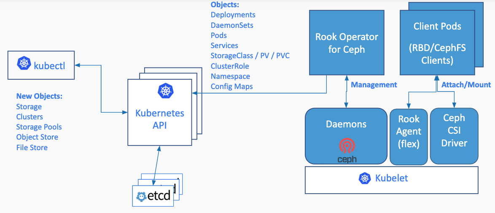

# Rook Operator & Ceph Storage on Kubernetes

Rook uses the power of the Kubernetes platform to deliver its services via a Kubernetes Operator for each storage provider.

> [Rook](https://rook.io/) turns distributed storage systems into self-managing, self-scaling, self-healing storage services. It automates the tasks of a storage administrator: deployment, bootstrapping, configuration, provisioning, scaling, upgrading, migration, disaster recovery, monitoring, and resource management.

As of now, only Ceph is stable with Rook

> [Ceph](https://ceph.com/en/) is a distributed storage system that provides file, block and object storage and is deployed in large scale production clusters.

Please refer to the [project status](https://github.com/rook/rook/blob/master/README.md#project-status) section of the Rook repository.

# Architecture

Rook enables Ceph storage systems to run on Kubernetes using Kubernetes primitives. The following image illustrates how Ceph Rook integrates with Kubernetes:


# Design



# Rook Setup

There are two main components: Ceph Operator, Ceph Cluster

## Ceph Operator

The Ceph Operator helm chart will install the basic components necessary to create a storage platform for your Kubernetes cluster.

```shell script
helm repo add rook-release https://charts.rook.io/release

helm install --namespace rook-ceph rook-ceph rook-release/rook-ceph -f values.yaml
```
Example `values.yaml`
```yaml
csi:
  enableRbdDriver: true
  enableCephfsDriver: true
imagePullSecrets:
- name: my-registry-secret
```
See the [complete list](https://rook.io/docs/rook/v1.7/helm-operator.html#configuration) of available parameters.

```shell script
(base) ➜  ~ kubectl -n rook-ceph get pod -l app=rook-ceph-operator
NAME                                  READY   STATUS    RESTARTS   AGE
rook-ceph-operator-679cdc9558-bfpff   1/1     Running   0          24m
```

## Ceph Cluster

### Ceph Prerequisites
In order to configure the Ceph storage cluster, at least one of these local storage options are required:

- Raw devices (no partitions or formatted filesystems)
- Raw partitions (no formatted filesystem)
- PVs available from a storage class in block mode

You can confirm whether your partitions or devices are formatted filesystems with the following command.
```shell script
lsblk -f
NAME                  FSTYPE      LABEL UUID                                   MOUNTPOINT
vda
└─vda1                LVM2_member       >eSO50t-GkUV-YKTH-WsGq-hNJY-eKNf-3i07IB
 ├─ubuntu--vg-root   ext4              c2366f76-6e21-4f10-a8f3-6776212e2fe4   /
 └─ubuntu--vg-swap_1 swap              9492a3dc-ad75-47cd-9596-678e8cf17ff9   [SWAP]
vdb
```
If the `FSTYPE` field is not empty, there is a filesystem on top of the corresponding device. In this case, you can use vdb for Ceph and can’t use vda and its partitions.

Ceph OSDs have a dependency on LVM
```shell script
# CentOS
sudo yum install -y lvm2
# Ubuntu
sudo apt-get install -y lvm2
```

Kernel requirements for RBD:
> Ceph requires a Linux kernel built with the RBD module. Many Linux distributions have this module, but not all distributions. For example, the GKE Container-Optimised OS (COS) does not have RBD.
```shell script
# sudo modprobe rbd

# lsmod | grep rbd
rbd                    86016  0
libceph               311296  2 ceph,rbd
```

Kernel requirements for CephFS:
> If you will be creating volumes from a Ceph shared file system (CephFS), the recommended minimum kernel version is 4.17. If you have a kernel version less than 4.17, the requested PVC sizes will not be enforced. Storage quotas will only be enforced on newer kernels.
