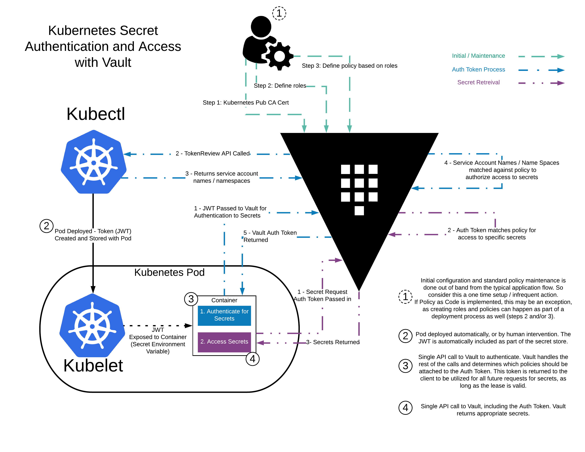

# Hashicorp Vault

Vault is a tool used to manage secrets. 

# Vault Architecture


# Vault Components

There are two main components: Server, Injector

## Vault Server

Vault Server is an application which will store the secrets and policies.

For High Availability, GCS can be used to persist Vault's data. 

Reference: [Google Cloud Storage Storage Backend](https://www.vaultproject.io/docs/configuration/storage/google-cloud-storage)

GCS Bucket can be created via Terraform or Ansible. Below is an example of Ansible.

```yaml
- name: "Creating a bucket for vault data"
  gcp_storage_bucket:
    name: "{{ gcp_bucket }}"
    project: "{{ gcp_project }}"
    auth_kind: "{{ gcp_cred_kind }}"
    service_account_file: "/tmp/{{ gcp_cred_file }}"
    state: present
```

Data inside GCS bucket will be encrypted using Google KMS Service. 
Hence, Vault server must have role `cloudkms.cryptoKeyEncrypterDecrypter`. 
Noted that due to this condition, a bucket and keyrings on KMS must be created before deploying Vault.

```yaml
- name: "Creating a KMS key ring"
  gcp_kms_key_ring:
    name: "{{ key_ring }}"
    location: "{{ gcp_location }}"
    project: "{{ gcp_project }}"
    auth_kind: "{{ gcp_cred_kind }}"
    service_account_file: "/tmp/{{ gcp_cred_file }}"
    state: present

- name: "Creating a crypto key for the key ring"
  gcp_kms_crypto_key:
    name: "{{ crypto_key }}"
    key_ring: "projects/{{ gcp_project }}/locations/{{ gcp_location }}/keyRings/{{ key_ring }}"
    project: "{{ gcp_project }}"
    auth_kind: "{{ gcp_cred_kind }}"
    service_account_file: "/tmp/{{ gcp_cred_file }}"
    state: present
```

Vault server will be deployed with a sidecar called vault-init. 
This sidecar also need access to configured bucket and will use KMS to decrypt data. 
Its responsibility is to initialise and unseal Vault pod whenever it is started. 
It is needed for High-Availability set up. 

References:
- [Auto-unseal using GCP Cloud KMS](https://learn.hashicorp.com/tutorials/vault/autounseal-gcp-kms)
- [The GCP Cloud KMS seal configurations](https://www.vaultproject.io/docs/configuration/seal/gcpckms)

## Vault Injector

This component has responsibility to inject vault-agent sidecars, which will pre-populate and update secrets as configured, to any pod whose required annotations (will be mentioned later). 

It use `MutatingWebhookConfiguration` to interfere pod creation. 


Noted that Vault injector does not works with istio. In the helm chart, by default it will disable istio for injector.

GitHub Issue: [vault-k8s and istio service mesh don't work together](https://github.com/hashicorp/vault-k8s/issues/41)

# Vault Setup

The Vault Helm chart is the recommended way to install and configure Vault on Kubernetes. 

Helm Chart: https://github.com/hashicorp/vault-helm \
Instructions: https://www.vaultproject.io/docs/platform/k8s/helm

Sample `values.yaml`
```yaml
global:
  enabled: true
  imagePullSecret: gcr-json-key
  imagePullSecrets:
    - name: gcr-json-key

server:
  image:
    repository: 'asia.gcr.io/PROJECT_ID/devops/vault'
    tag: '1.4.0'

  annotations:
    prometheus.io/scrape: "true"
    prometheus.io/port: "8200"
    prometheus.io/path: "/v1/sys/metrics"

  extraEnvironmentVars:
    GOOGLE_REGION: REGION
    GOOGLE_PROJECT: PROJECT_ID
    GOOGLE_APPLICATION_CREDENTIALS: /vault/userconfig/prod-kms-vault-creds/prod-vault.json
    HTTP_PROXY: IF_ANY
    HTTPS_PROXY: IF_ANY

  extraVolumes:
    - type: 'secret'
      name: 'prod-kms-vault-creds'

  ha:
    enabled: true
    replicas: 3

    config: |
      ui = true

      listener "tcp" {
        tls_disable = 1
        address = "[::]:8200"
        cluster_address = "[::]:8201"
      }

      seal "gcpckms" {
        project     = "PROJECT_ID"
        region      = "REGION"
        key_ring    = "prod_vault_key_ring"
        crypto_key  = "prod_vault_crypto_key"
      }

      storage "gcs" {
        bucket = "prod-vault"
        ha_enabled    = "true"
      }

      telemetry {
        prometheus_retention_time = "5m"
        disable_hostname = true
      }

ui:
  enabled: true
  serviceType: NodePort
```
The same config will be available at `/vault/config/extraconfig-from-values.hcl` inside Vault pods.

[Google KMS Auto Unseal](https://www.vaultproject.io/docs/platform/k8s/helm/run#google-kms-auto-unseal) is used to auto unseal the vault.
Also, checkout [Auto-unseal using GCP Cloud KMS](https://learn.hashicorp.com/tutorials/vault/autounseal-gcp-kms?in=vault/auto-unseal) using Terraform.

Helm Chart Configurations: https://www.vaultproject.io/docs/platform/k8s/helm/configuration

Auto-unseal does not initialize Vault. When you run `vault operator init`, root token will be found there.

```yaml
kubectl -n vault exec devops-vault-0 -- vault status

kubectl -n vault exec devops-vault-0 -- vault operator init -recovery-shares=1 -recovery-threshold=1

kubectl -n vault exec devops-vault-0 -- vault status

Key                      Value
---                      -----
Recovery Seal Type       shamir
Initialized              true
Sealed                   false
Total Recovery Shares    1
Threshold                1
Version                  1.4.0
Cluster Name             vault-cluster-fb97d7f5
Cluster ID               c235a780-c82b-49f6-9c1c-e4f93ccf69a9
HA Enabled               true
HA Cluster               https://devops-vault-0.devops-vault-internal:8201
HA Mode                  active

kubectl -n vault exec devops-vault-1 -- vault status

Key                      Value
---                      -----
Recovery Seal Type       shamir
Initialized              true
Sealed                   false
Total Recovery Shares    1
Threshold                1
Version                  1.4.0
Cluster Name             vault-cluster-fb97d7f5
Cluster ID               c235a780-c82b-49f6-9c1c-e4f93ccf69a9
HA Enabled               true
HA Cluster               https://devops-vault-1.devops-vault-internal:8201
HA Mode                  standby
Active Node Address      http://192.168.78.194:8200
```
In HA mode, 1 will be active, and others will be standby.

After Initialization, you'll get root token as shown below. Keep it safe. 
```shell script
Recovery Key 1: hmempMOTCWB2nFK2i1EixevS1P4TmRbhwKJYjeUeCSY=

Initial Root Token: s.SUVXmDNxVColi4kSBbTPm57A

Success! Vault is initialized

Recovery key initialized with 1 key shares and a key threshold of 1. Please
securely distribute the key shares printed above.
```
References:
- [Root Tokens](https://www.vaultproject.io/docs/concepts/tokens#root-tokens)
- [Generate Root Tokens Using Unseal Keys](https://learn.hashicorp.com/tutorials/vault/generate-root)

# Secrets Permissions

There are two set of permissions: 
- Users to manage secrets in Vault
- Applications to use those secrets from Vault

Before we proceed, let's enable Kubernetes Authentication:

```shell script
vault auth list
vault auth enable userpass
vault auth enable kubernetes

vault write auth/kubernetes/config \
        token_reviewer_jwt="$(cat /var/run/secrets/kubernetes.io/serviceaccount/token)" \
        kubernetes_host="https://X.X.X.X:443" \
        kubernetes_ca_cert=@/var/run/secrets/kubernetes.io/serviceaccount/ca.crt

Success! Data written to: auth/kubernetes/config
```
You can get `kubernetes_host` from `kubectl cluster-info`

Another way to enable and configure Kubernetes auth method:
```shell script
# assuming there is `vault-auth` service account

export VAULT_SA_NAME=$(kubectl get sa vault-auth \
    --output jsonpath="{.secrets[*]['name']}")

export SA_JWT_TOKEN=$(kubectl get secret $VAULT_SA_NAME \
    --output 'go-template={{ .data.token }}' | base64 --decode)

export SA_CA_CRT=$(kubectl config view --raw --minify --flatten \
    --output 'jsonpath={.clusters[].cluster.certificate-authority-data}' | base64 --decode)

export K8S_HOST=$(kubectl config view --raw --minify --flatten \
    --output 'jsonpath={.clusters[].cluster.server}')

vault auth enable kubernetes

vault write auth/kubernetes/config \
        token_reviewer_jwt="$SA_JWT_TOKEN" \
        kubernetes_host="$K8S_HOST" \
        kubernetes_ca_cert="$SA_CA_CRT"
```

Getting Accessor:
- For User, it is `auth_userpass_f713c411`
- For K8s, it is `auth_kubernetes_4ee00d74`

```shell script
vault auth list -detailed
# Explore the auth methods
vault path-help auth/userpass
vault path-help auth/ldap
vault path-help auth/ldap/config

/ $ vault auth list
Path           Type          Accessor                    Description
----           ----          --------                    -----------
kubernetes/    kubernetes    auth_kubernetes_4ee00d74    n/a
token/         token         auth_token_04f4486f         token based credentials
userpass/      userpass      auth_userpass_f713c411      n/a
```

## User Permissions

Create secret engine with specific path for the team
```shell script
vault secrets list
vault secrets list -format=json
vault secrets enable -path=devopsteam kv-v2
```
Create a policy (for example creating below policy at /tmp/devopsteam.hcl)
```shell script
# List, create, read, and update key/value secrets
path "secret/*" {
  capabilities = ["create", "read", "list", "update"]
}

path "sys/internal/*"
{
	capabilities = ["create", "read", "list", "update", "delete"]
}

# Create and manage secrets engines broadly across Vault.
path "sys/mounts"
{
  capabilities = ["read", "list"]
}

path "sys/mounts/devopsteam"
{
  capabilities = ["create", "read", "update", "delete", "list", "sudo"]
}

path "sys/mounts/devopsteam/*"
{
  capabilities = ["create", "read", "update", "delete", "list", "sudo"]
}

path "devopsteam"
{
	capabilities = ["create", "read", "list", "update", "delete"]
}

path "devopsteam/*"
{
	capabilities = ["create", "read", "list", "update", "delete"]
}

# https://learn.hashicorp.com/vault/identity-access-management/policy-templating
# allow every user to change its own password

path "auth/userpass/users/{{identity.entity.aliases.auth_userpass_f713c411.name}}" {
  capabilities = [ "update" ]
  allowed_parameters = {
    "password" = []
  }
}

# Grant permissions on the group specific path
# The team is specified in the group metadata
path "devopsteam/data/devopsteam/{{identity.groups.names.devopsteam.metadata.team}}/*" {
    capabilities = [ "create", "update", "read", "delete", "list" ]
}

# Group member can update the group information
path "identity/group/id/{{identity.groups.names.devopsteam.id}}" {
  capabilities = [ "update", "read" ]
}

# For Web UI usage
path "devopsteam/metadata" {
  capabilities = ["list"]
}

path "identity/group/id" {
  capabilities = [ "list" ]
}
```
Apply the policy
```shell script
vault policy list
vault policy write devopsteam /tmp/devopsteam.hcl
```
Create a group
```shell script
vault write identity/group name=devopsteam policies=devopsteam metadata=team="DEVOPSTEAM"
```
Create user, identity and alias, adding members to the group
```shell script
vault write auth/userpass/users/nirav password=XXX policies=devopsteam
vault write identity/entity name=nirav policies=devopsteam metadata=team="DEVOPSTEAM"

Key        Value
---        -----
aliases    <nil>
id         631256b1-8523-9838-5501-d0a1e2cdad9c

vault write identity/entity-alias name=nirav mount_accessor=auth_userpass_f713c411 canonical_id=631256b1-8523-9838-5501-d0a1e2cdad9c

Key             Value
---             -----
canonical_id    631256b1-8523-9838-5501-d0a1e2cdad9c
id              873f7b12-dec8-c182-024e-e3f065d8a9f1

vault write identity/group name=devopsteam member_entity_ids=631256b1-8523-9838-5501-d0a1e2cdad9c metadata=team="DEVOPSTEAM"
vault login -method=userpass username=nirav password=XXX
vault token lookup
```
Also, login through Web UI and check the credentials.

## Application Permissions

We can write simple policy for an application as given below
```shell script
vault policy write myapp-kv-ro - <<EOF
path "secret/data/myapp/*" {
    capabilities = ["read", "list"]
}
EOF
```
OR we can use [Recommended Pattern for Vault ACL Policy Path Templates](https://learn.hashicorp.com/tutorials/vault/pattern-policy-templates)

You can also check [Write templated ACL policies](https://learn.hashicorp.com/tutorials/vault/policy-templating#available-templating-parameters) which shows various dynamic substitutions for a templated ACL policy.

[Kubernetes Auth Login](https://www.vaultproject.io/api-docs/auth/kubernetes#login) Metadata can be retrieved and seen as below:

```json
# Sample Payload
{
  "role": "dev-role",
  "jwt": "eyJhbGciOiJIUzI1NiIsInR5cCI6IkpXVCJ9..."
}

# Sample Request
curl \
    --request POST \
    --data @payload.json \
    http://127.0.0.1:8200/v1/auth/kubernetes/login

# Sample Response
{
  "auth": {
    "client_token": "62b858f9-529c-6b26-e0b8-0457b6aacdb4",
    "accessor": "afa306d0-be3d-c8d2-b0d7-2676e1c0d9b4",
    "policies": ["default"],
    "metadata": {
      "role": "test",
      "service_account_name": "vault-auth",
      "service_account_namespace": "default",
      "service_account_secret_name": "vault-auth-token-pd21c",
      "service_account_uid": "aa9aa8ff-98d0-11e7-9bb7-0800276d99bf"
    },
    "lease_duration": 2764800,
    "renewable": true
  }
}
```

This is the Kubernetes Namespace.

`namespace`: `identity.entity.aliases.<mount accessor>.metadata.service_account_namespace`.

This is the Kubernetes Service Account name for the application.

`app-name`: `identity.entity.aliases.<mount accessor>.metadata.service_account_name.` 

Create a policy at `/tmp/devopsteam-app-policy.hcl`
```shell script
# This means that each service account can read/list secret in this path secrets/[namespace]/[service_account]/*

path "devopsteam/data/{{identity.entity.aliases.auth_kubernetes_4ee00d74.metadata.service_account_namespace}}/{{identity.entity.aliases.auth_kubernetes_4ee00d74.metadata.service_account_name}}/*" {
    capabilities = [ "read", "list" ]
}
```
Write a policy
```shell script
vault policy write devopsteam-app-policy /tmp/devopsteam-app-policy.hcl
```
Create a role
```json
# Create a default role for all namespaces and all service accounts
vault write auth/kubernetes/role/devopsteam-app-role \
        bound_service_account_names=* \
        bound_service_account_namespaces=* \
        policies=devopsteam-app-policy \
        ttl=24h
```
OR
```shell script
vault write auth/$CLUSTER_NAME/role/$APP_NAMESPACE-$APP_NAME \
       bound_service_account_names=$APP_NAME \
       bound_service_account_namespaces=$APP_NAMESPACE \
       policies=$CLUSTER_NAME-kv-read \
       period=120s
```
Now, users can write a secret to their specific path in Vault.

# How to Inject Secrets

There are two ways to inject secret: Annotations, ConfigMaps

## By Annotations

The Vault Agent Injector only modifies a deployment if it contains a specific set of annotations.

https://www.vaultproject.io/docs/platform/k8s/injector/annotations

Example:
```shell script
vault.hashicorp.com/agent-inject: "true"
vault.hashicorp.com/agent-inject-status: "update"
vault.hashicorp.com/agent-inject-secret-helloworld: "secrets/default/default/helloworld"
vault.hashicorp.com/agent-inject-template-helloworld: |
  {{- with secret "secrets/defaultNamespace/serviceAccount/helloworld" -}}
  postgresql://{{ .Data.data.username }}:{{ .Data.data.password }}@postgres:5432/wizard
  {{- end }}
vault.hashicorp.com/role: 'default-app-role'
vault.hashicorp.com/agent-init-first: "true"
# to only have init container and disable sidecar container
vault.hashicorp.com/agent-pre-populate-only: "true"
``` 
> A common mistake is to set the annotation on the Deployment or other resource. Ensure that the injector annotations are specified on the pod specification when using higher level constructs such as deployments, jobs or statefulsets.

If no template is provided the following generic template is used:
```shell script
{{ with secret "/path/to/secret" }}
    {{ range $k, $v := .Data }}
        {{ $k }}: {{ $v }}
    {{ end }}
{{ end }}
```
Init vs Sidecar
- Init only container to pre-populate secrets before an application starts. For example, a backup job that runs on a regular schedule and only needs an initial secret at start time.
- Init and Sidecar. Init container to fetch secrets before an application starts, and a Sidecar container that starts alongside your application for keeping secrets fresh (sidecar periodically checks to ensure secrets are current). For example, a web application that is using dynamic secrets to connect to a database with an expiring lease.

Few things to keep in mind:
- `vault.hashicorp.com/agent-inject-template`-`NAME`: By default, this annotation will amount to /vault/secrets/`NAME` with value as specified in template. The path can be changed using vault.hashicorp.com/secret-volume-path annotation. Please refer to annotation documentation above for more detail. The `NAME` must also be appear in vault.hashicorp.com/agent-inject-secret-`NAME`
- `vault.hashicorp.com/role`: Role of the application as mentioned above. 
- `vault.hashicorp.com/agent-init-first`: "true": This annotation is needed to make sure that vault-agent-init sidecar will be initialized before other sidecar if necessary. For example, most pods will be launched with istio proxy and this annotation is needed, so that the vault-agent-init sidecar will be launched before istio-init sidecar. Otherwise, vault-agent-init cannot connect to Vault pods, because in initializing phase, after istio-init sidecar is completed, pods cannot connect to others without istio-proxy sidecar, which will be launched in later phase of pod lifecycle.

## By ConfigMap

This way is for advanced use cases, [Vault Agent Configuration Map](https://www.vaultproject.io/docs/platform/k8s/injector#vault-agent-configuration-map)

For advanced use cases, it may be required to define Vault Agent configuration files to mount instead of using secret and template annotations. The Vault Agent Injector supports mounting ConfigMaps by specifying the name using the `vault.hashicorp.com/agent-configmap` annotation. The configuration files will be mounted to `/vault/configs`.

The configuration map must contain either one or both of the following files:
- `config-init.hcl` used by the `init` container. This must have `exit_after_auth` set to `true`.
- `config.hcl` used by the `sidecar` container. This must have `exit_after_auth` set to `false`.

An example of mounting a Vault Agent configmap [can be found here](https://www.vaultproject.io/docs/platform/k8s/injector/examples#configmap-example).

Working Example:
```yaml
apiVersion: v1
kind: ServiceAccount
metadata:
  name: test-template
  namespace: default
---
apiVersion: apps/v1
kind: Deployment
metadata:
  name: app
  labels:
    app: vault-agent-demo
spec:
  selector:
    matchLabels:
      app: vault-agent-demo
  replicas: 1
  template:
    metadata:
      annotations:
        vault.hashicorp.com/agent-inject: "true"
        vault.hashicorp.com/agent-configmap: "test-secret-configmap"
        vault.hashicorp.com/agent-init-first: "true"
      labels:
        app: vault-agent-demo
    spec:
      serviceAccountName: test-template
      containers:
      - name: app
        image: asia.gcr.io/devops/hello-world:1.0.0
---
apiVersion: v1
kind: ConfigMap
metadata:
  name: test-secret-configmap
data:
  config.hcl: |
    "auto_auth" = {
      "method" = {
        "config" = {
          "role" = "default-app-role"
        }
        "type" = "kubernetes"
      }
      "sink" = {
        "config" = {
          "path" = "/home/vault/.token"
        }
 
        "type" = "file"
      }
    }
 
    "exit_after_auth" = false
    "pid_file" = "/home/vault/.pid"
 
    "template" = {
      "contents" = "{{- with secret \"secrets/default/test-template/helloworld\" -}}postgresql:{{ .Data.data.username }}:{{ .Data.data.password }}@postgres:5432/wizard{{- end }}"
      "destination" = "/vault/secrets/db-creds"
    }
 
    "vault" = {
      "address" = "http://vault.default.svc.cluster.local:8200"
    }
  config-init.hcl: |
    "auto_auth" = {
      "method" = {
        "config" = {
          "role" = "default-app-role"
        }
        "type" = "kubernetes"
      }
      "sink" = {
        "config" = {
          "path" = "/home/vault/.token"
        }
 
        "type" = "file"
      }
    }
 
    "exit_after_auth" = true
    "pid_file" = "/home/vault/.pid"
 
    "template" = {
      "contents" = "{{- with secret \"secrets/default/test-template/helloworld\" -}}postgresql:{{ .Data.data.username }}:{{ .Data.data.password }}@postgres:5432/wizard{{- end }}"
      "destination" = "/vault/secrets/db-creds"
    }
    "vault" = {
      "address" = "http://vault.default.svc.cluster.local:8200"
    }
```
# Enabling Audit Logs
```shell script
/ $ vault audit enable file file_path=/vault/vault-audit.log
Success! Enabled the file audit device at: file/

/ $ vault audit list -detailed
Path     Type    Description    Replication    Options
----     ----    -----------    -----------    -------
file/    file    n/a            replicated     file_path=/vault/vault-audit.log
```

# Enabling prometheus
```shell script
# prometheus.hcl
path "sys/metrics*" {
    capabilities = ["read"]
}

vault policy write prometheus /tmp/prometheus.hcl
vault token create -policy=prometheus
```
- [Prometheus Configuration](https://www.vaultproject.io/docs/configuration/telemetry#prometheus)
- [Vault Telemetry](https://www.vaultproject.io/docs/internals/telemetry)

# Agent Workflow


# Learning Resources
- [Getting-Started-Vault by Ned Bellavance](https://github.com/ned1313/Getting-Started-Vault)
- [Managing-HashiCorp-Vault by Ned Bellavance](https://github.com/ned1313/Managing-HashiCorp-Vault)
- [Vault Presentation](https://hashicorp.github.io/field-workshops-vault/slides/multi-cloud/vault-oss)
- [Vault Workshop](https://play.instruqt.com/hashicorp/topics/vault-workshops)
- [Hashicorp Playground](https://play.instruqt.com/hashicorp)