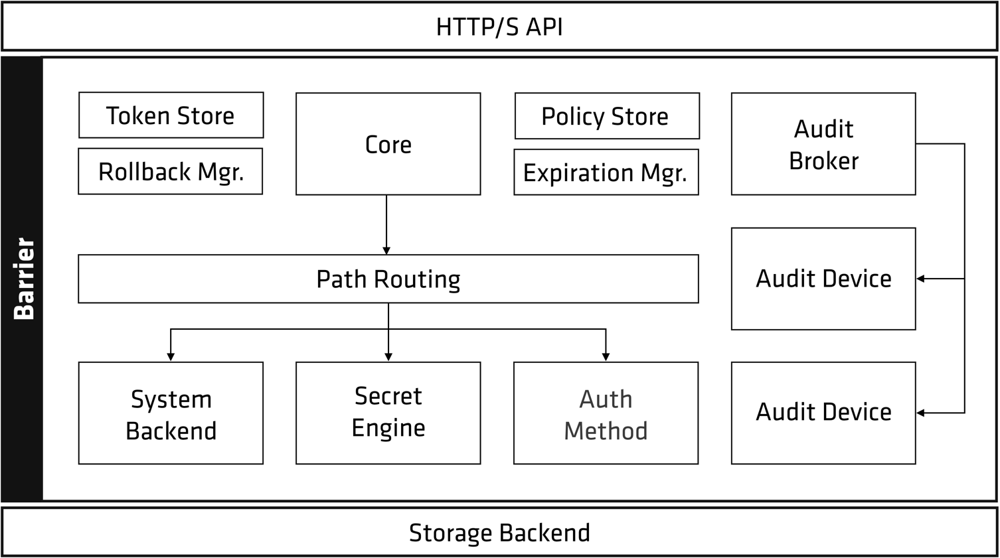

# Hashicorp Vault

Vault is a tool used to manage secrets. 

# Vault Architecture



# Vault Components

There are two main components: Server, Injector

## Vault Server

Vault Server is an application which will store the secrets and policies.

For High Availability, GCS can be used to persist Vault's data. 

Reference: [Google Cloud Storage Storage Backend](https://www.vaultproject.io/docs/configuration/storage/google-cloud-storage)

GCS Bucket can be created via Terraform or Ansible. Below is an example of Ansible.

```yaml
- name: "Creating a bucket for vault data"
  gcp_storage_bucket:
    name: "{{ gcp_bucket }}"
    project: "{{ gcp_project }}"
    auth_kind: "{{ gcp_cred_kind }}"
    service_account_file: "/tmp/{{ gcp_cred_file }}"
    state: present
```

Data inside GCS bucket will be encrypted using Google KMS Service. 
Hence, Vault server must have role `cloudkms.cryptoKeyEncrypterDecrypter`. 
Noted that due to this condition, a bucket and keyrings on KMS must be created before deploying Vault.

```yaml
- name: "Creating a KMS key ring"
  gcp_kms_key_ring:
    name: "{{ key_ring }}"
    location: "{{ gcp_location }}"
    project: "{{ gcp_project }}"
    auth_kind: "{{ gcp_cred_kind }}"
    service_account_file: "/tmp/{{ gcp_cred_file }}"
    state: present

- name: "Creating a crypto key for the key ring"
  gcp_kms_crypto_key:
    name: "{{ crypto_key }}"
    key_ring: "projects/{{ gcp_project }}/locations/{{ gcp_location }}/keyRings/{{ key_ring }}"
    project: "{{ gcp_project }}"
    auth_kind: "{{ gcp_cred_kind }}"
    service_account_file: "/tmp/{{ gcp_cred_file }}"
    state: present
```

Vault server will be deployed with a sidecar called vault-init. 
This sidecar also need access to configured bucket and will use KMS to decrypt data. 
Its responsibility is to initialise and unseal Vault pod whenever it is started. 
It is needed for High-Availability set up. 

References:
- [Auto-unseal using GCP Cloud KMS](https://learn.hashicorp.com/tutorials/vault/autounseal-gcp-kms)
- [The GCP Cloud KMS seal configurations](https://www.vaultproject.io/docs/configuration/seal/gcpckms)

## Vault Injector

This component has responsibility to inject vault-agent sidecars, which will pre-populate and update secrets as configured, to any pod whose required annotations (will be mentioned later). 

It use `MutatingWebhookConfiguration` to interfere pod creation. 


Noted that Vault injector does not works with istio. In the helm chart, by default it will disable istio for injector.

GitHub Issue: [vault-k8s and istio service mesh don't work together](https://github.com/hashicorp/vault-k8s/issues/41)

# Vault Setup

The Vault Helm chart is the recommended way to install and configure Vault on Kubernetes. 

Helm Chart: https://github.com/hashicorp/vault-helm \
Instructions: https://www.vaultproject.io/docs/platform/k8s/helm


